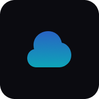
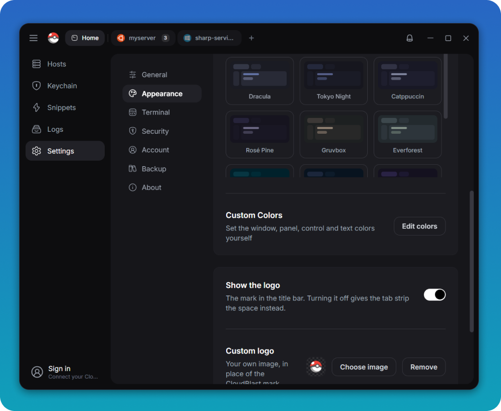

<p align="center">
  
</p>

<h1 align="center">CloudTerm</h1>

<p align="center">
  <strong>SSH, SFTP, Telnet y Windows RDP, todo en un solo terminal</strong>
</p>

<p align="center">
  Un espacio de trabajo de terminal moderno, hecho con Electron, React y xterm.js.<br/>
  Paneles divididos · Pestañas · Transferencia de archivos · Reenvío de puertos · Escritorios remotos · Fragmentos
</p>

<p align="center">
  <a href="https://github.com/BradPerbs/cloudterm/releases/latest"></a>
  &nbsp;
  <a href="#"></a>
  &nbsp;
  <a href="LICENSE"></a>
  &nbsp;
  <a href="https://discord.gg/7M84Xp8QBr"></a>
</p>

<p align="center">
  <a href="./README.md">English</a> ·
  <a href="./README.zh-CN.md">简体中文</a> ·
  <strong>Español</strong> ·
  <a href="./README.ru.md">Русский</a>
</p>

---

CloudTerm reúne en una sola ventana todas las formas de llegar a un servidor.
Abre una sesión SSH, mueve archivos por SFTP, reenvía un puerto y toma un
escritorio de Windows, todo sobre la misma conexión y la misma barra de
pestañas. Sin una segunda aplicación y sin un segundo inicio de sesión.

Se conecta a lo que sea: la consola serie de tu portátil, un switch que solo
habla telnet, una máquina Windows por RDP o un servidor en el proveedor que
prefieras. CloudTerm está hecho por [CloudBlast](https://cloudblast.io), una
empresa de hosting VPS. Es gratuito para todo el mundo y todo el código está aquí
para leerlo y modificarlo.


---

<h2 align="center">☁️ Sincronización en la nube gratis, para todos</h2>

<p align="center">
  <strong>Tu configuración en todos tus equipos, sin coste alguno.</strong><br/>
  Hosts, carpetas, claves, fragmentos, claves de host de confianza y ajustes del terminal,<br/>
  cifrados en tu equipo antes de salir de él y restaurados en cuanto inicias sesión en otro sitio.
</p>

<p align="center">
  Gratis con una cuenta de <a href="https://cloudblast.io"><strong>CloudBlast</strong></a>,
  alojes o no un solo servidor con nosotros.
</p>

<p align="center">
  <a href="https://cloudblast.io"></a>
</p>

<p align="center">
  <sub>¿Ya eres cliente de CloudBlast? Tus servidores aparecen solos en la lista de hosts, listos para conectar.</sub>
</p>

---

## Contenido

- [Qué es CloudTerm](#what-is-cloudterm)
- [Características](#features)
- [Capturas](#screenshots)
- [Primeros pasos](#getting-started)
- [Comunidad](#community)
- [Tecnología](#tech-stack)
- [Licencia](#license)

---

<a name="what-is-cloudterm"></a>
## Qué es CloudTerm

- **Un terminal** para SSH, telnet y consolas serie, con pestañas, paneles
  divididos y renderizado acelerado por GPU.
- **Un cliente SFTP** sobre la conexión que ya tienes abierta, con
  transferencias recursivas y arrastrar y soltar.
- **Un visor RDP y VNC**, para que una máquina Windows y una Linux convivan en
  la misma aplicación.
- **Un sitio donde guardar servidores**: carpetas, etiquetas, un almacén de
  claves y fragmentos, todo cifrado y todo buscable.

<a name="features"></a>
## Características

### Terminal

- **Paneles divididos** en cualquier disposición, con zoom y pantalla completa
- **Pestañas** con nombre, color y grupo, restauradas al volver a abrir
- **36 temas**, o elige tú mismo los colores
- **Búsqueda en el historial** con expresiones regulares, y enlaces pulsables
- **Entrada difundida** a todas las sesiones a la vez
- **Grabación de sesiones** y capturas con un clic

### Conexiones

- **SSH, telnet y serie** en la misma ventana
- **Hosts de salto** para todo lo que esté detrás de un bastión
- **Contraseñas, claves, agente SSH, certificados** y claves de Windows Hello
  guardadas en el TPM
- **Solicitudes de 2FA** gestionadas como es debido
- **Reconexión automática** tras una caída o al despertar el portátil
- **Comandos al conectar**, repetidos en cada reconexión

### Archivos y red

- **Gestor SFTP completo**: transferencias recursivas, reanudación, resolución
  de conflictos y arrastrar y soltar
- **Edita archivos remotos** en tu propio editor, subidos en cada guardado
- **Reenvío de puertos**: local, remoto y SOCKS5 dinámico, con contadores de
  tráfico en vivo
- **Escritorios remotos**: RDP y VNC en un panel, tunelizados por SSH

### Organización

- **Carpetas y etiquetas de colores** en toda la lista de hosts
- **Fragmentos** con valores que se piden al vuelo, y paquetes que ejecutan
  varios en orden
- **Búsqueda instantánea** por nombre, dirección y etiqueta
- **Importa** tu `~/.ssh/config` existente en un paso

### Seguridad

- **Almacén cifrado** para cada credencial, tras una contraseña de apertura
  opcional
- **Verificación de claves de host** en cada conexión y en cada salto
- **Sincronización en la nube gratuita**, cifrada en tu equipo antes de subirse
- **Copias de seguridad cifradas** que llevan toda tu configuración a otro equipo
- **Registro de actividad** de cada conexión y cada cambio

---

<a name="screenshots"></a>
## Capturas

### Hosts y llavero

Cada servidor en carpetas, con etiquetas, búsqueda y el protocolo en la tarjeta.
Inicia sesión en CloudBlast y tus servidores aparecen aquí solos.


### Paneles divididos y SFTP

Archivos a la izquierda, dos shells a la derecha, una sola conexión detrás de
las tres. Divide hasta donde dé la ventana y arrastra los separadores a tu gusto.


### Windows RDP

Un escritorio de Windows completo en una pestaña, junto a tus sesiones de Linux.
El portapapeles funciona en ambos sentidos y el escritorio se ajusta al panel.


### Hazlo tuyo

Temas del terminal, colores de la aplicación, fuentes e incluso el logo de la
barra de título.



---

<a name="getting-started"></a>
## Primeros pasos

```bash
git clone https://github.com/BradPerbs/cloudterm.git
cd cloudterm
npm install
npm run dev
```

Compila un ejecutable portable en `dist/`:

```bash
npm run build
```

### Atajos

| | | | |
| --- | --- | --- | --- |
| `Ctrl+Shift+F` | Buscar en el historial | `Alt+Shift+=` | Dividir a la derecha |
| `Ctrl+Shift+K` | Paleta de fragmentos | `Alt+Shift+-` | Dividir abajo |
| `Ctrl+Shift+B` | Entrada difundida | `Alt+Shift+Z` | Ampliar panel |
| `Ctrl+Shift+C` / `V` | Copiar y pegar | `Ctrl+Shift+W` | Cerrar panel |

<a name="community"></a>
## Comunidad

¿Dudas, errores, ideas para nuevas funciones, o simplemente quieres ver qué
viene después?

<p>
  <a href="https://discord.gg/7M84Xp8QBr"></a>
</p>

Las issues y los pull requests son bienvenidos aquí en GitHub.

<a name="tech-stack"></a>
## Tecnología

Electron · React · xterm.js · ssh2 · IronRDP (WebAssembly) · noVNC · Tailwind ·
Vite

`src/main/` es el proceso principal de Electron, un módulo por función.
`src/renderer/` es la interfaz React: `components/` por función, `hooks/` para el
estado y `lib/` para funciones puras.

<a name="license"></a>
## Licencia

CloudTerm es [fair-code](https://faircode.io) bajo la
[Licencia CloudTerm](LICENSE): el código está abierto y el software se puede
usar, modificar y compartir libremente, en el trabajo o donde sea. Venderlo, o
meter cualquier parte de su código en algo por lo que cobres, requiere una
licencia comercial de [CloudBlast](https://cloudblast.io), que normalmente basta
con pedir.
